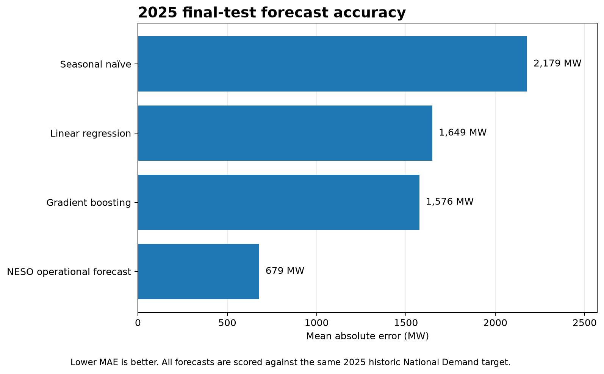
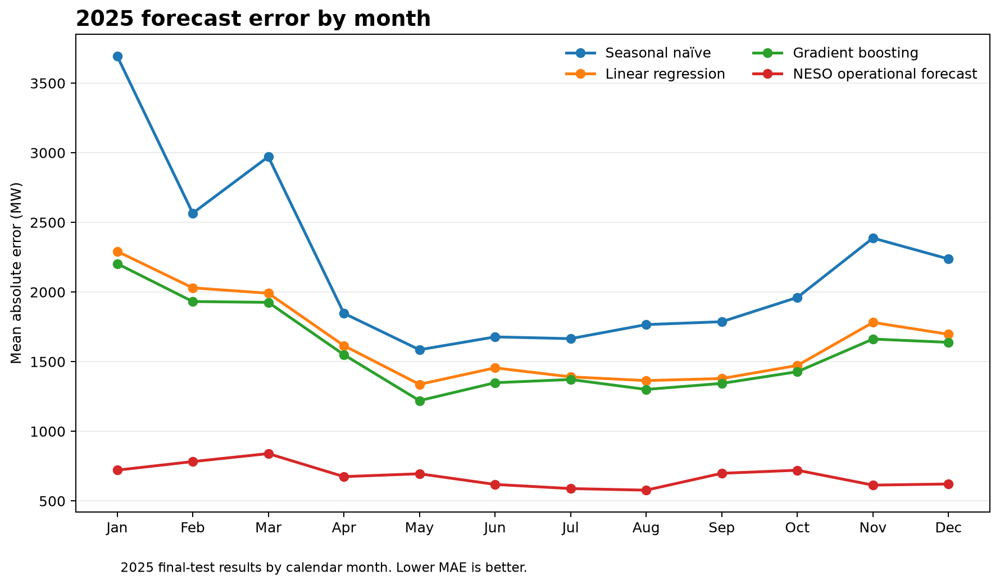
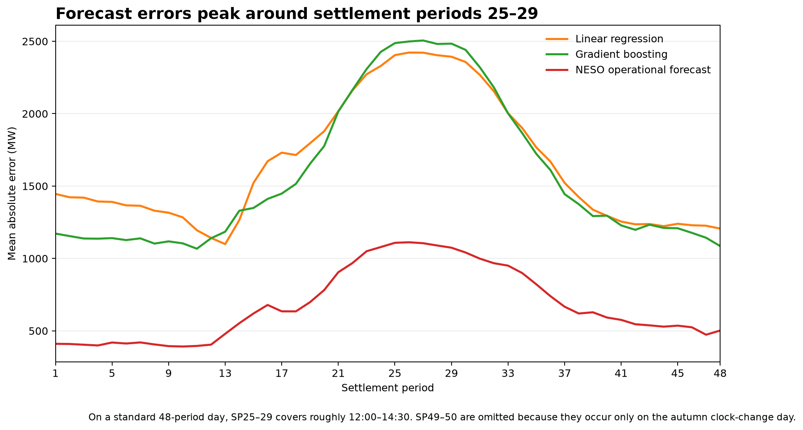
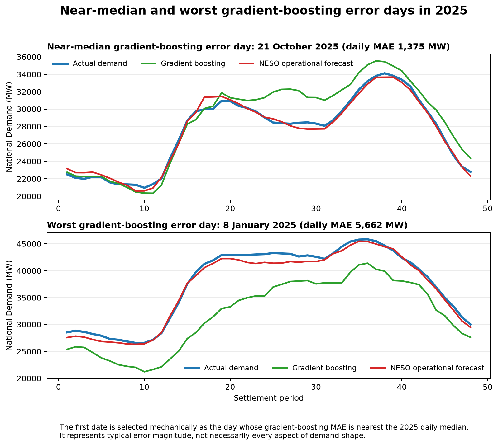

# Great Britain Day-Ahead Electricity Demand Forecasting

This project asks a practical question: **how accurately can Great Britain's electricity demand be forecast, half-hour by half-hour, one day ahead?**

The model is only allowed to use information that could genuinely have been available when each forecast was issued. This is a **leakage-aware** design: it prevents the model from accidentally benefiting from information from the future.

The analysis uses electricity-demand data from the **National Energy System Operator (NESO)** and a reproducible pipeline built with BigQuery, dbt and Python.

## Reading the results

A few terms are useful before getting into the analysis:

- **NESO** — the National Energy System Operator.
- **National Demand** — NESO's measure of Great Britain's electricity generation requirement, measured in megawatts.
- **MW** — megawatts, the unit used here for electricity demand and forecast error.
- **Settlement period** — one half-hour period. A normal day contains 48 settlement periods; UK clock-change days can contain 46 or 50.
- **Day-ahead forecast** — a forecast issued on the previous day for electricity demand on the following day.
- **MAE (mean absolute error)** — the average size of the forecast miss, regardless of whether the forecast was too high or too low. Lower is better.
- **Benchmark** — a simple reference forecast used to judge whether a more sophisticated model genuinely adds value.
- **Data leakage** — using information that would not actually have been available when the forecast was made.

## Analytical question

Using only information that would have been available when the day-ahead forecast was issued, how accurately can a deliberately constrained model forecast Great Britain National Demand for each half-hour period, where are its errors concentrated, and how does it compare with a simple benchmark and NESO's operational forecast?

## What did the model achieve?

The best model built in this project was **histogram gradient boosting**, a non-linear tree-based machine-learning method.

On the untouched 2025 test period, it was about **1,576 MW away from actual National Demand on average**.

For comparison:

- simply using demand from the same half-hour one week earlier produced an average error of about **2,179 MW**;
- linear regression reduced this to about **1,649 MW**;
- gradient boosting reduced it further to about **1,576 MW**;
- NESO's operational forecast was substantially more accurate at about **679 MW**.

The main improvement therefore came from moving beyond the simple one-week benchmark. Gradient boosting reduced average error by **27.7%** versus that benchmark, but only by **4.4%** versus linear regression. The extra non-linear complexity helped, although the additional gain over the linear model was fairly modest.

NESO's average error was **56.9% lower** than the gradient-boosting model's. The project model is therefore best treated as an independently reproducible benchmark and analytical case study, not as a proposed replacement for NESO's operational forecasting process.



All four forecasts below are scored against the same historic National Demand target and the same 17,512 half-hour records with all required modelling inputs.

| Forecast | MAE (MW) | RMSE (MW) | Bias (MW) | MAPE |
|---|---:|---:|---:|---:|
| Same half-hour one week earlier | 2,178.73 | 2,917.34 | -42.43 | 8.439% |
| Linear regression | 1,648.63 | 2,137.38 | +43.59 | 6.568% |
| Histogram gradient boosting | 1,575.51 | 2,099.93 | -23.20 | 6.231% |
| NESO operational forecast | **678.94** | **910.91** | +14.13 | **2.688%** |

The supporting metrics add different information:

- **RMSE (root mean squared error)** is another measure of forecast error, but gives unusually large misses more weight. Lower is better.
- **Bias** shows whether forecasts tend to be too high or too low on average. Positive values indicate over-forecasting and negative values under-forecasting.
- **MAPE (mean absolute percentage error)** expresses the average absolute error as a percentage of actual demand. Lower is better.

## Where do the errors occur?

The overall average hides a clear month-to-month pattern.

Gradient boosting has lower MAE than linear regression in every month of the 2025 test period. January is the least accurate month for both project models.



There is also a clear pattern within the day.

Gradient-boosting error is highest around settlement periods 25–29, which covers roughly **12:00–14:30** on a standard 48-period day.



Individual days can also be much harder than the annual average suggests.

The worst gradient-boosting day in 2025 was **8 January**, when its average absolute error across the day was approximately **5,662 MW**.

The first panel below is not hand-picked as a flattering example. It is selected mechanically as the date whose daily gradient-boosting error is closest to the 2025 median.



These patterns are descriptive. I have not attributed the large January errors to weather, system events or other causes without evidence that would support that conclusion.

## Does the result persist in later data?

A separate **robustness check** tests whether the main findings still hold in a later period without redesigning the model after seeing those results.

After the 2025 final test was complete, the same model specifications were refitted using the available 2021–2025 history and evaluated on a fixed period from **1 January to 2 September 2026**.

Across all 11,752 half-hour periods with the required model inputs:

| Forecast | MAE (MW) |
|---|---:|
| Same half-hour one week earlier | 2,146.38 |
| Linear regression | 1,686.67 |
| Histogram gradient boosting | **1,597.45** |

No matching NESO forecast is available for the 48 model rows on 2 September in the captured comparison data.

For the 11,704 periods through 1 September where all four forecasts can be compared fairly:

| Forecast | MAE (MW) |
|---|---:|
| Same half-hour one week earlier | 2,146.05 |
| Linear regression | 1,682.79 |
| Histogram gradient boosting | 1,593.92 |
| NESO operational forecast | **789.97** |

The same broad pattern therefore holds in the later period: gradient boosting remains the most accurate of the three project models, while NESO remains considerably more accurate.

NESO's average absolute error is **50.4% lower** than gradient boosting on this common 2026 sample.

September contains only one common comparison day, so its monthly result should not be treated as representative of the month.

## How was the model validated?

The project uses **chronological validation** rather than randomly mixing observations from different years.

That matters for forecasting because later observations should not be allowed to influence decisions that would supposedly have been made earlier.

| Period | Role |
|---|---|
| 2021–2023 | Model development |
| 2024 | Validation and model selection |
| 2025 | Untouched final test |
| 2026 | Separate later-period robustness check |

The model progression was deliberately limited to:

1. a simple one-week benchmark;
2. ordinary linear regression;
3. one stronger non-linear challenger using histogram gradient boosting.

The features, model family and hyperparameters were fixed before the 2025 final test was examined.

This prevents the final test period from becoming another round of model tuning.

### Final model inputs

The models use:

- half-hour settlement period;
- day of week;
- calendar month;
- England and Wales bank-holiday status;
- Scotland bank-holiday status;
- bank-holiday status of the corresponding historic comparison dates;
- demand from the same settlement period 2 days earlier;
- demand from the same settlement period 7 days earlier;
- demand from the same settlement period 14 days earlier.

The historic demand inputs are often described as **lags**: for example, a 7-day lag means demand from the same half-hour one week earlier.

The final gradient-boosting configuration was:

```text
HistGradientBoostingRegressor(
    learning_rate=0.05,
    max_iter=200,
    max_leaf_nodes=31,
    l2_regularization=1.0,
    random_state=42
)
```

## Preventing data leakage

The governing test for every possible model input was:

> Would this exact information genuinely have been available when the day-ahead forecast was issued?

NESO's `Publish_Datetime` is retained through the data pipeline as the forecast-issue timestamp used to reason about availability.

That rule excludes several predictors that might otherwise appear attractive.

A 1-day demand lag is not used because the previous day's complete demand profile would not always have been available when the day-ahead forecast was issued.

Observed weather for the target day is also excluded. Using weather that was only observed after the forecast was issued would give the model future information. A future extension could instead use archived weather forecasts that were genuinely available before the relevant forecast was made.

The 2-, 7- and 14-day demand lags are treated as historical information that had already occurred. However, the project does not reconstruct the exact publication vintage of every historical demand observation, so later revisions to historic data remain an explicit limitation.

See [`docs/leakage_register.md`](docs/leakage_register.md) for the feature-level decisions.

## Data pipeline

The project uses a warehouse-style workflow rather than analysing downloaded files directly.

```text
NESO public API
        |
        v
Python acquisition and validation
        |
        v
BigQuery raw layer
        |
        v
dbt staging models
        |
        v
analysis-ready forecasting model
        |
        v
Python validation, final test and robustness analysis
        |
        v
reproducible tables and figures
```

Raw source fields are loaded into BigQuery before parsing and standardisation in dbt.

The staging layer handles year-specific source differences explicitly and preserves legitimate 46-, 48- and 50-period daylight-saving days.

The final modelling layer contains one record per settlement date and half-hour settlement period, together with the target, calendar information, leakage-controlled historic demand features and evaluation-period label.

## Comparing the project models with NESO

NESO's operational forecast is rescored against the same historic `national_demand_mw` target used for the project models.

This produces a like-for-like settlement-period comparison instead of simply reusing NESO's published error field, which can use a TRIAD-adjusted demand outturn.

The source data also contain malformed forecast-performance records on 31 October 2021 and 30 October 2022. Those records are preserved in the source pipeline rather than silently rewritten, and excluded where necessary from the like-for-like NESO comparison.

## Linear-model implementation check

During 2024 validation, I found that scikit-learn produced slightly different ordinary least-squares results depending on whether the one-hot encoded feature matrix was represented in sparse or dense form.

The features and training rows were identical; the difference arose because the two representations use different numerical solver paths.

The original sparse implementation produced validation MAE of **1,610.05 MW**, while the dense implementation produced **1,593.40 MW**.

The dense implementation was therefore fixed as the final linear benchmark before the 2025 test was opened. The earlier implementation remains visible in the Git history rather than being silently overwritten.

## Repository structure

```text
analysis/
    forecasting_utils.py
    model_validation.py
    final_test_analysis.py
    robustness_2026.py
    publication_figures.py

src/
    acquire_neso.py
    validate_neso.py
    load_bigquery_raw.py

models/
    sources/
    staging/
    intermediate/

tests/
    dbt data-quality tests

outputs/
    figures/
    tables/

docs/
    published case study
    source and architecture documentation
    leakage register
    project plan
```

The main analytical scripts have distinct roles:

- `model_validation.py` reproduces the 2024 validation and model-comparison stage;
- `final_test_analysis.py` evaluates the fixed models and NESO on 2025 and writes the publication tables;
- `robustness_2026.py` performs the separate 2026 robustness evaluation;
- `publication_figures.py` generates the published figures from validated CSV outputs rather than retraining the models.

## Reproducibility

Python dependencies are pinned in [`requirements.txt`](requirements.txt).

The project requires access to the configured Google Cloud / BigQuery project. dbt uses a local `profiles.yml`, which is intentionally excluded from Git.

Raw NESO downloads are also deliberately excluded from Git and are reacquired from the public API.

Because a public data source can be revised after publication, a fresh download at a later date is not guaranteed to reproduce the exact source bytes used for the published analysis. The repository preserves the acquisition configuration, transformations and analytical logic needed to reproduce the workflow.

The broad reproduction sequence is:

```powershell
.\.venv\Scripts\python.exe .\src\acquire_neso.py
.\.venv\Scripts\python.exe .\src\validate_neso.py
.\.venv\Scripts\python.exe .\src\load_bigquery_raw.py

.\.venv\Scripts\dbt.exe run --profiles-dir .
.\.venv\Scripts\dbt.exe test --profiles-dir .

.\.venv\Scripts\python.exe .\analysis\model_validation.py
.\.venv\Scripts\python.exe .\analysis\final_test_analysis.py
.\.venv\Scripts\python.exe .\analysis\robustness_2026.py
.\.venv\Scripts\python.exe .\analysis\publication_figures.py
```

Supporting implementation notes are available in:

- [`docs/source_architecture.md`](docs/source_architecture.md)
- [`docs/data_acquisition.md`](docs/data_acquisition.md)
- [`docs/bigquery_raw_ingestion.md`](docs/bigquery_raw_ingestion.md)
- [`docs/dbt_source_layer.md`](docs/dbt_source_layer.md)
- [`docs/leakage_register.md`](docs/leakage_register.md)

## Limitations

The main limitations are:

- the project intentionally uses a relatively narrow feature set and does not attempt to reproduce NESO's full operational forecasting environment;
- archived target-day weather forecasts are not included;
- exact contemporaneous publication vintages of historic demand observations are not reconstructed;
- bank-holiday indicators cannot represent every unusual operational or behavioural event;
- the 2026 robustness period covers only part of the year;
- no matching NESO forecast rows are available for 2 September 2026 in the captured fixed robustness window;
- observed patterns in forecast error do not by themselves establish their underlying causes.

The project should therefore be interpreted as a leakage-controlled independent forecasting benchmark and error-analysis case study, rather than as a replacement for an operational electricity-demand forecasting system.

## Technology

- Python
- pandas
- scikit-learn
- Matplotlib
- SQL
- BigQuery
- dbt
- Git and GitHub

## Data source

National Energy System Operator (NESO) Data Portal.

Source definitions, retrieval details and validation decisions are documented in [`docs/source_architecture.md`](docs/source_architecture.md) and [`docs/data_acquisition.md`](docs/data_acquisition.md).
